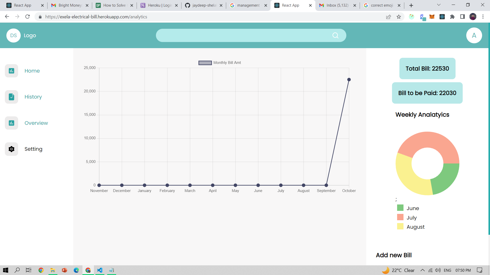

# Bill Management

  

 

> Bill management app made using MERN stack  

## ⚙️ Detailed Functionality

- The user must be able to manually add, edit and remove bills. (data is stored in MongoDB database using NodeJS) ✅
- The user must be able to filter bills by category. (category filter dropdown) ✅
- Draw a time-series chart of the monthly billing cycle. ✅
- The user can see the total amount of bills and the total amount yet to be paid ✅
- If the total amount exceeds the total budget user will not be able to add a new bill ✅

## 🚀 Tech and Tools Used

- React.JS ,Redux ,NodeJS ,ExpressJs,MongoDB
- VS code,Heruko
- React Icons,REST APIS

## 📸 Screenshots

## Home Page

 

## Bill Detail Page

## Add or Edit Form

## Chart

### LINK :

https://exela-electrical-bill.herokuapp.com
