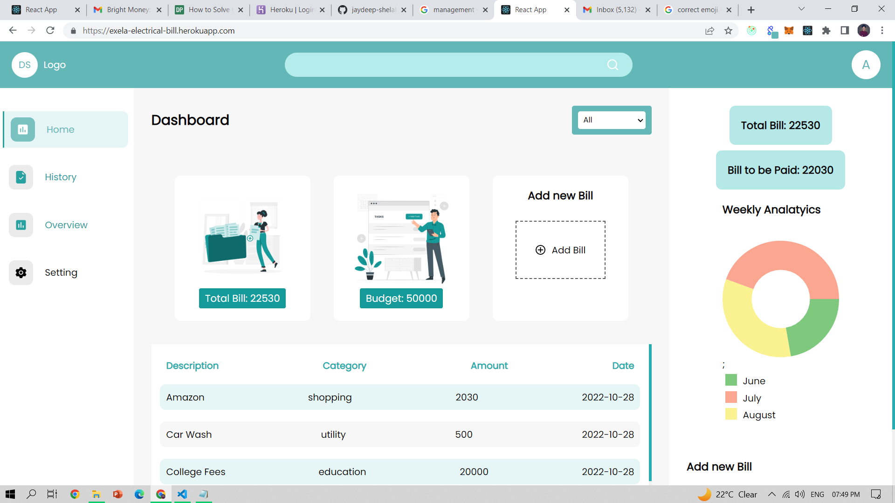
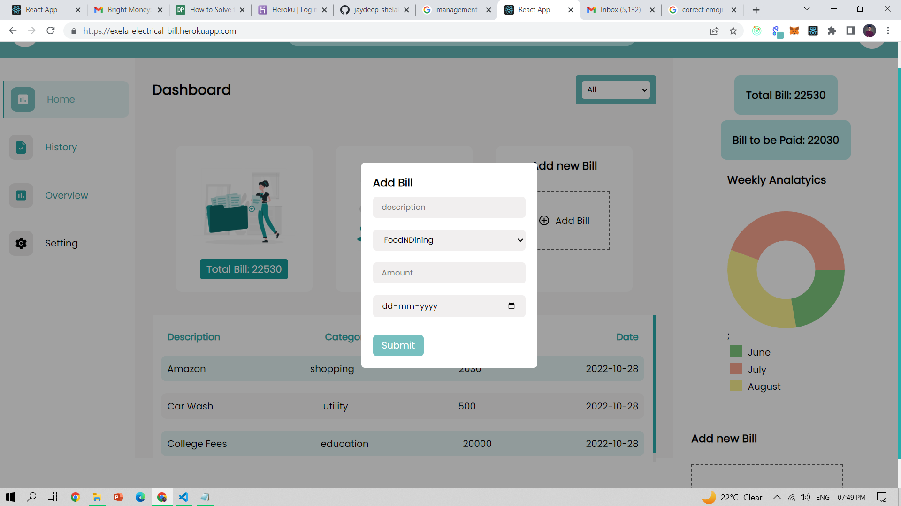

# Food Delivery

  

 

> Eleric bill app made using MERN stack (Exela Hiring Challenge )  
> Followed MVC architecture and microservices for serever side

## ⚙️ Detailed Functionality

- User can add the electric bills
- Users can update quantity bill
- User can delete the bill
- User can paginate
- User can view there old bills
- User can add , edit or delete the bill

## 🚀 Tech and Tools Used

- React.JS ,Redux ,NodeJS ,ExpressJs,MongoDB
- VS code,Heruko
- React Icons,REST APIS

## 📸 Screenshots

## Home Page

 

## Bill Detail Page

## Add or Edit Form

### LINK :

https://exela-electrical-bill.herokuapp.com
